<div align="center">

<!-- HERO CAPSULE BANNER -->


<!-- ANIMATED TYPING SUBTITLE -->
<a href="#">
  
</a>

<br/>

<!-- STATUS BADGES -->
<p align="center">
  
  
  
  
</p>

<!-- SOCIAL ORBIT -->
<p align="center">
  <a href="mailto:robinaustinj@gmail.com">
    
  </a>
  <a href="https://github.com/AUSTIN-JR">
    
  </a>
  <a href="#">
    
  </a>
</p>

</div>

---

### 📡 `austin@gotham:~# cat /etc/identity.conf`

```ini
[IDENTITY]
  Operator        = Austin J Robin (AUSTIN-JR)
  Designation     = Cybersecurity Student & AI-Augmented Builder
  Philosophy      = Vibe Coding (Idea → Multi-Agent Orchestration → Flawless Execution)
  Atmosphere      = Gotham rain, midnight neon, high-fidelity bass in headphones
  Core Arsenal    = Cursor, Claude Code, Google Antigravity, ChatGPT, Grok, Lovable
  Gaming Codex    = 67+ Finished Titles (PS2 Classics to Modern Masterpieces)
  Current Mission = Offensive/Defensive Security, AI Workflows & Next-Gen Web Craft

[ACTIVE_DIRECTIVE]
  "It's only after we've lost everything that we're free to do anything."
```

---

<div align="center">

## ⚡ The Vibe Coding Doctrine

> *"Vibe coding isn't about skipping the work—it's about removing friction between pure imagination and execution."*

</div>

<table>
  <tr>
    <td width="33%" align="center">
      <br/>
      <b>01 // THE VISION</b><br/>
      <sub>Start with an intuition. No waiting for permission. Envision the interface, the security perimeter, or the concept with zero compromise.</sub>
    </td>
    <td width="33%" align="center">
      <br/>
      <b>02 // AI SYMBIOSIS</b><br/>
      <sub>Collaborate with an entire fleet of cutting-edge models as cognitive exoskeletons. Rapid prototyping, intelligent debugging, and continuous synthesis.</sub>
    </td>
    <td width="33%" align="center">
      <br/>
      <b>03 // OBSESSIVE CRAFT</b><br/>
      <sub>Shape it until it feels undeniably mine. Top-tier animations, resilient edge-case handling, and distinct nocturnal aesthetics.</sub>
    </td>
  </tr>
</table>

---

<div align="center">

## 🤖 The AI Exoskeleton • Neural Arsenal & Autonomous Fleet

*Orchestrating state-of-the-art intelligence to build, research, and defend at superhuman velocity.*

</div>

<br/>

### ⚡ 1. Autonomous Coding Agents & AI IDEs
<p align="center">
  
  
  
  
  
</p>

### 🧠 2. Frontier Reasoning & LLM Powerhouses
<p align="center">
  
  
  
  
  
  
</p>

### 🚀 3. Full-Stack Vibe Coding & Generative UI
<p align="center">
  
  
  
</p>

### 🎨 4. Visual Synthesis, Research & Knowledge Engines
<p align="center">
  
  
  
</p>

---

## 🛡️ Cyber Arsenal & Tech Stack

<div align="center">

### 🔒 Security, Networks & Core Engines
<a href="#">
  
</a>

<br/><br/>

### 💻 Code, Scripting & Web Craft
<a href="#">
  
</a>

<br/><br/>

### 🛠️ Developer Workspace & Production Matrix
<a href="#">
  
</a>

</div>

---

<div align="center">

## 🎮 The Completed Campaign Vault • 67 Conquered Games

<p align="center">
  
  
  
</p>

> *"Give me a story worth following, characters worth remembering, and an atmosphere worth losing sleep over. These are the worlds I entered, survived, and finished."*

<br/>

### 🦇 Batman & Arkhamverse
<p align="center">
  
  
  
  
  
  
</p>

### ⚔️ God of War: Full Greek & Norse Sagas (9/9 Finished)
<p align="center">
  
  
  
  
  
  
  
  
  
</p>

### 🗡️ Assassin's Creed Chronicles (13 Sagas)
<p align="center">
  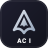
  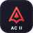
  
  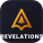
  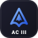
  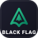
  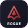
  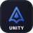
  
  
  
  
  
</p>

### 🏙️ Grand Theft Auto: 3D Universe
<p align="center">
  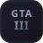
  
  
  
  
</p>

### 🧭 Uncharted: Nathan Drake & Chloe Frazer
<p align="center">
  
  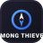
  
  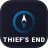
  
</p>

### 🕸️ The Spider-Man Multiverse
<p align="center">
  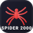
  
  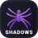
  
  
</p>

### ⏳ Prince of Persia Saga
<p align="center">
  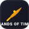
  
  
  
  
  
</p>

### 🕶️ Hitman: Agent 47 World of Assassination
<p align="center">
  
  
  
</p>

### 🧬 Open-World Vigilantes & Cyberpunk Action
<p align="center">
  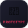
  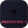
  
  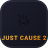
  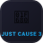
  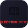
  
  
  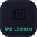
</p>

### 🔥 PS2 Golden Era Legends & Martial Arts
<p align="center">
  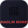
  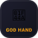
  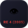
  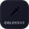
  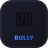
  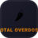
  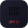
  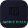
  
  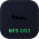
  
  
  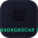
  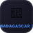
</p>

</div>

---

## 🎧 The Heavy Rotation • Nocturnal Soundscape

<div align="center">

*Music isn't background noise—it's fuel for late-night breakthroughs.*

<table>
  <tr>
    <td align="center" width="25%">
      <br/>
      <b>TUPAC SHAKUR</b><br/>
      <sub><i>Raw intensity, uncompromising truth, iconic defiance.</i></sub><br/>
      <code>♫ Ambitionz Az A Ridah</code>
    </td>
    <td align="center" width="25%">
      <br/>
      <b>KENDRICK LAMAR</b><br/>
      <sub><i>Architectural storytelling, intricate flows, supreme vision.</i></sub><br/>
      <code>♫ Alright • DNA.</code>
    </td>
    <td align="center" width="25%">
      <br/>
      <b>KANYE WEST</b><br/>
      <sub><i>Boundary-shattering production & fearless innovation.</i></sub><br/>
      <code>♫ Stronger • Heartless</code>
    </td>
    <td align="center" width="25%">
      <br/>
      <b>MICHAEL JACKSON</b><br/>
      <sub><i>The blueprint of perfection, rhythm, and timeless groove.</i></sub><br/>
      <code>♫ Smooth Criminal • Billie Jean</code>
    </td>
  </tr>
</table>

</div>

---

## 📊 Live Telemetry & GitHub Analytics

<div align="center">

<!-- STATS & STREAK GRID -->
<table border="0">
  <tr>
    <td align="center">
      
    </td>
    <td align="center">
      
    </td>
  </tr>
</table>

<br/>

<!-- TOP LANGUAGES & ACTIVITY GRAPH -->


<br/><br/>


</div>

---

## 🦇 Encrypted Batcomputer Archives

<details>
<summary><b>▶ CLICK TO DECRYPT GOTHAM DOSSIER // [CLASSIFIED]</b></summary>
<br/>

```text
[GOTHAM CITY TERMINAL // NODE-7]
> Connection encrypted via 4096-bit RSA handshake.
> Security Protocol: ARKHAM-DEFENDER

AI SYNERGY PROTOCOL:
├── Primary IDEs: Cursor & Google Antigravity
├── CLI Companion: Claude Code
├── Generation & Synthesis: ChatGPT, Grok, Gemini, Lovable
└── Creative Visuals: Canva Magic Studio & Midjourney

GAMING CODEX:
├── Total Finished Campaigns: 67 Titles
├── Legendary Runs: God of War Greek & Norse Pantheons (100%),
│   Assassin's Creed from Altaïr to Basim (100%),
│   Nathan Drake's Uncharted Odyssey,
│   Batman Arkham Hexalogy.

PHILOSOPHY OF THE NIGHT:
"It is not who I am underneath, but what I do that defines me."
Every commit is an iteration. Every vulnerability is a lesson.
The night is young, the terminal is open, and there is always something to build.
```

</details>

---

<div align="center">

<!-- FOOTER ANIMATED WAVE -->


<p align="center">
  <sub><b>Austin J Robin</b> • Powered by autonomous AI agents, curiosity, and high-octane vibe coding.</sub><br/>
  <sub>🦇 <i>"Stay dangerous. Keep building."</i> 🦇</sub>
</p>

</div>
